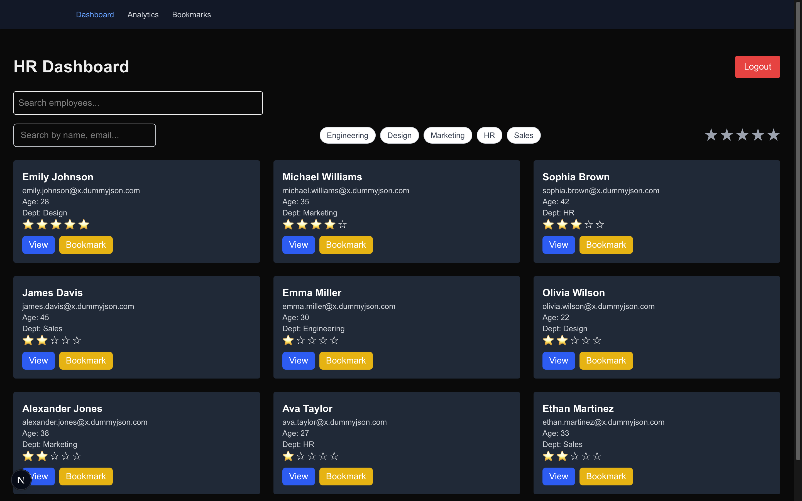
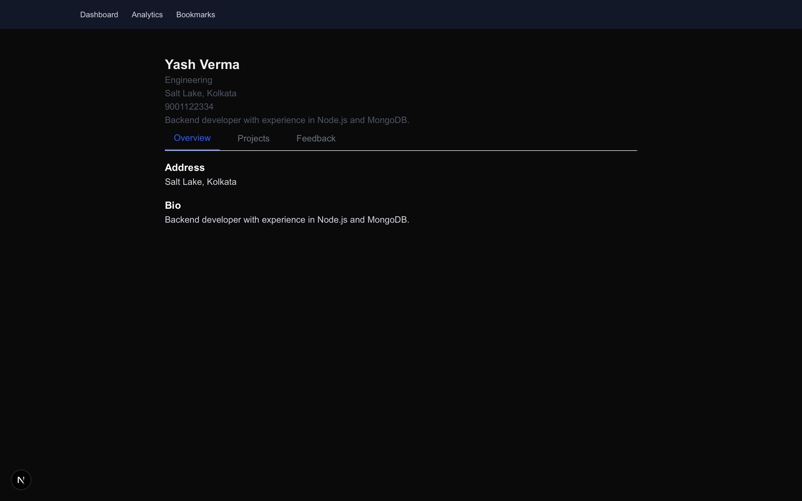
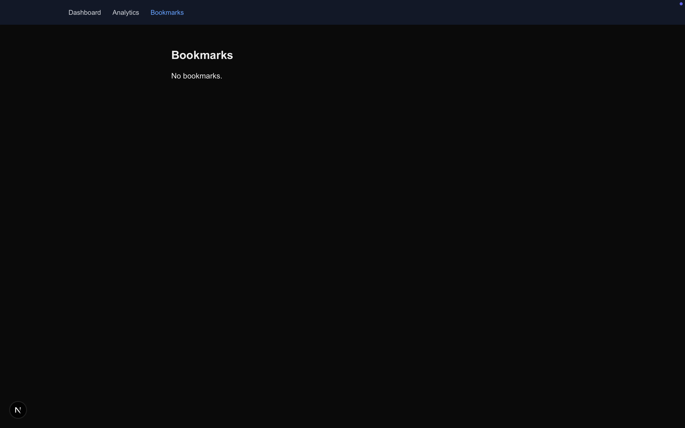
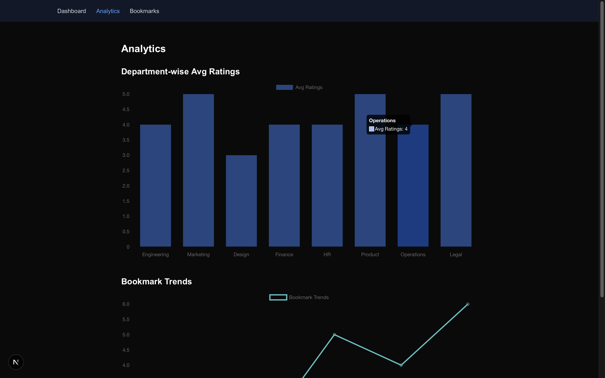

# 💼 Flam HR Dashboard

An advanced HR Performance Dashboard built with **Next.js App Router**, **Tailwind CSS**, and **TypeScript**, enabling HR Managers to monitor employee performance, manage bookmarks, and explore detailed insights with ease.

🔗 **Live Demo**: [https://your-deployment-link.vercel.app](https://your-deployment-link.vercel.app)

---

## 🚀 Tech Stack

- ⚛️ **React** (via **Next.js 15** App Router)
- 🎨 **Tailwind CSS** for styling and dark/light mode
- 📜 **TypeScript** for type safety
- 🗂 **Context API** for state management
- 📊 **Chart.js** for analytics and data visualization
- 🧠 **Custom Hooks** for search, bookmarks, and logic handling
- 🔄 **Dynamic Routing** via Next.js
- ✅ **Modular & Scalable Folder Structure**

---

## 🧩 Features Overview

### 🏠 Dashboard Homepage (`/`)
- Fetches employees from [`dummyjson.com`](https://dummyjson.com/users?limit=20)
- Displays:
  - Full Name, Email, Age
  - Randomly generated Department
  - Performance Rating (1–5 stars)
- Action Buttons: `View`, `Bookmark`, `Promote`

### 🔍 Search & Multi-Filter
- Case-insensitive **search bar**: filters by name, email, or department
- **Multi-select filter**: Department & Performance rating

### 👤 Employee Detail Page (`/employee/[id]`)
- Displays full user profile:
  - Phone, Address, Bio
  - Performance history (mocked, randomized)
  - Star ratings and colored badges
- Dynamic **Tabbed UI**:
  - `Overview` | `Projects` | `Feedback` (lazy loaded with mock data)
- Clean and responsive layout with loading states

### 📌 Bookmark Manager (`/bookmarks`)
- View all bookmarked employees
- Unbookmark, Promote, or Assign to Project (UI interactions)

### 📊 Analytics Dashboard (`/analytics`)
- Visualizes:
  - 📈 Average rating per department
  - 🔖 Bookmark trends
- Built using **Chart.js**

---

## 🌐 Pages Implemented

| Route            | Description                              |
|------------------|------------------------------------------|
| `/`              | Dashboard with all users and filters     |
| `/employee/[id]` | Detailed employee profile with tabs      |
| `/bookmarks`     | Bookmark manager with UI actions         |
| `/analytics`     | Charts and performance insights          |

---

## 🧠 Advanced Capabilities

- ✅ Fully responsive & mobile-first layout
- 🌙 Dark / Light Mode toggle using Tailwind classes
- 🧩 Modular folder structure:
  - `components/`, `hooks/`, `lib/`, `app/employee/[id]/`
- ⚙️ Custom reusable components:
  - `UserCard`, `RatingBadge`, `Tabs`, `Button`, `SearchBar`
- 📦 State handled using **Context API**
- 🔁 Component-level loading and error states
- 🔍 `useBookmarks` and `useSearch` custom hooks
- ⚡ Keyboard accessibility for interactive elements

---

## 📸 Screenshots

### 📊 Dashboard Homepage  


### 👤 Employee Detail Page  


### 📌 Bookmarks  


### 📈 Analytics Charts  


---

## 🧪 Getting Started Locally

1. **Clone the repository**
```bash
git clone https://github.com/Axshuman/flam-hr-dashboard.git
cd flam-hr-dashboard
```

2. **Install dependencies**
```bash
npm install
```

3. **Run the app**
```bash
npm run dev
```

4. **Visit**
```
http://localhost:3000
```

---

## ❗ What's Not Implemented

❌ "Create User" form with validation (intentionally skipped)

---

## 📄 License

This project is licensed under the MIT License.